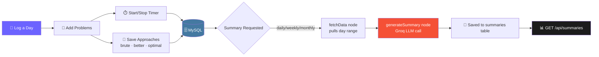

<div align="center">


<br/>


<br/><br/>


</div>

<br/>

## 📖 About

**NeetCode Tracker** is a backend that turns your daily DSA practice into structured, queryable data — then uses an **LLM agent (LangGraph + Groq)** to generate reflective summaries of your progress, so you can actually see how you're improving instead of just guessing.

<div align="center">

</div>

---

## ✨ Features

<table>
<tr>
<td width="50%" valign="top">

### 📅 Day Tracking
Log a practice day with a number, date, and freeform notes. Every problem you solve that day is linked back to it.

### 🧩 Problem Management
Full CRUD for problems — title, URL, difficulty, and pattern (e.g. `sliding-window`, `two-pointers`).

</td>
<td width="50%" valign="top">

### ⏱️ Built-in Timer
Start/stop a timer per problem to track exactly how long each attempt takes you.

### 🧠 Multi-Approach Storage
Save your **brute force → better → optimal** journey per problem, each with its own code, complexity, and notes.

</td>
</tr>
<tr>
<td width="50%" valign="top">

### 🤖 AI Summaries
A LangGraph agent pulls your day/problem/approach data and asks Groq to generate daily, weekly, or monthly recaps.

</td>
<td width="50%" valign="top">

### 🗄️ Auto-Synced Schema
MySQL tables sync automatically on boot via Sequelize/ORM — no manual migrations needed to get started.

</td>
</tr>
</table>

---

## 🏗️ How It Works



---

## 🚀 Quick Start

 **1. Install dependencies**

```bash
npm install
```

 **2. Configure environment**

```bash
cp .env.example .env
# fill in your DB credentials + GROQ_API_KEY
```

 **3. Create an empty database**

```sql
CREATE DATABASE neetcode_tracker;
```

 **4. Run it**

```bash
npm start
```

> Tables sync automatically on boot — no manual migrations required. ✅

---

## 📡 API Reference

### 📅 Days

| Method | Endpoint | Body | Description |
|--------|----------|------|--------------|
| `POST` | `/api/days` | `{ dayNumber, date?, notes? }` | Create a new day |
| `GET` | `/api/days` | — | List all days |
| `GET` | `/api/days/:dayNumber` | — | Get a day with its problems + approaches |

### 🧩 Problems

| Method | Endpoint | Body | Description |
|--------|----------|------|--------------|
| `POST` | `/api/problems` | `{ dayNumber, title, url?, difficulty?, pattern? }` | Add a problem |
| `GET` | `/api/problems/:id` | — | Get a problem |
| `PUT` | `/api/problems/:id` | — | Update a problem |
| `DELETE` | `/api/problems/:id` | — | Delete a problem |
| `POST` | `/api/problems/:id/timer/start` | — | Start the solve timer |
| `POST` | `/api/problems/:id/timer/stop` | — | Stop the solve timer |

### 🧠 Approaches

| Method | Endpoint | Body | Description |
|--------|----------|------|--------------|
| `POST` | `/api/approaches` | `{ problemId, type: brute\|better\|optimal, code, language?, timeComplexity?, spaceComplexity?, notes? }` | Upsert an approach per problem + type |
| `PUT` | `/api/approaches/:id` | — | Update an approach |
| `DELETE` | `/api/approaches/:id` | — | Delete an approach |

### 🤖 Summaries <sub><i>(LangGraph + Groq agent)</i></sub>

| Method | Endpoint | Body | Description |
|--------|----------|------|--------------|
| `POST` | `/api/summaries/daily` | `{ dayNumber }` | Generate a daily summary |
| `POST` | `/api/summaries/weekly` | `{ fromDay, toDay }` | Generate a weekly summary |
| `POST` | `/api/summaries/monthly` | `{ fromDay, toDay }` | Generate a monthly summary |
| `GET` | `/api/summaries?type=daily\|weekly\|monthly` | — | Fetch saved summaries |

**Summary flow:** `fetchData` node pulls days/problems/approaches for the requested range → `generateSummary` node calls Groq → result is saved to the `summaries` table.

---

## 🗂️ Tech Stack

<div align="center">


</div>

---

## 🛣️ Roadmap

- [ ] Auth + multi-user support
- [ ] Streak tracking & heatmap endpoint
- [ ] Export summaries as PDF/Markdown
- [ ] Pattern-based analytics (weakest patterns, avg time by difficulty)
- [ ] Webhook/Slack digest for weekly summaries

---

<div align="center">

### ⭐ If this helped organize your grind, consider starring the repo


</div>
